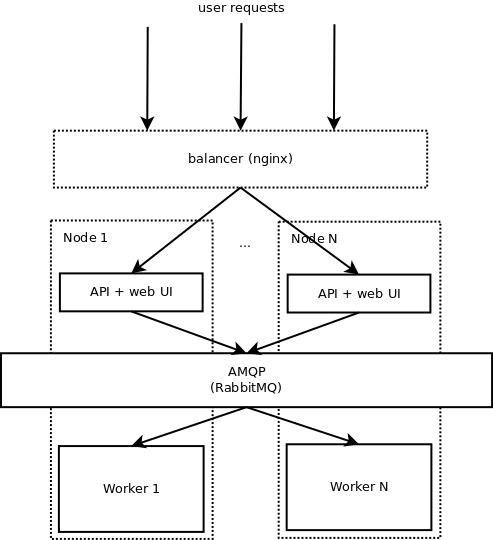

# DATADOCS

__www.datadocs.com__

Data processing engine + search/analysis/visualization.

## Install

- Oracle JDK ^1.8
- maven 3.x
- Intellij Idea (+ Project Lombok plug-in)
- RabbitMQ
- ElasticSearch 5.1.2 (custom build)
- PostgreSQL ^9.3
- MongoDB
- npm ^2.x
- gulp
- ansible ^2.1
- git

Import into Intellij IDEA as Maven Project.
Set environment variables (eg Run Configuration menu in Intellij Idea)

```properties
DB_HOST=localhost                  # DB host
DB_PORT=5432                       # DB port
DB_NAME=dataparse                  # DB name
DB_USERNAME=user                   # DB username
DB_PASSWORD=user                   # DB password
DB_RECREATE=false                  # set to 'true' to re-create DB on app launch
ES_INDEX_THREADS=1                 # number of ES indexing threads per node
ES_INDEX_BULK_BYTE_SIZE=5242880    # max size of ES bulk request 
STORAGE=ALWAYS_LOCAL               # file storage type: ALWAYS_LOCAL, ALWAYS_GRID_FS, ALWAYS_AWS_S3, ALWAYS_GCS, DEPENDING_ON_FILE_SIZE
ENGINE=ALWAYS_ES                   # ALWAYS_ES, ALWAYS_BQ, DEPENDING_ON_DATASET_SIZE
MONGO_DB_NAME=dataparse            # name of MongoDB database
ENABLE_SCHEDULER=true              # set to 'true' to enable scheduled tasks
```

Before first launch create new database in PostgreSQL.
Each time you launch application make sure CSS files are built with `gulp`.
`gulp` also starts watcher that will rebuild CSS resources on any change. 

When preparing a release build with `gulp release` full copy of assets is made
(in order to obfuscate JS along with some custom release settings). 
Then `release` maven profile is activated so that this copy of assets 
is moved to target instead of default assets. 
In case you want to test released build locally, you should uncomment these
lines in pom.xml to set `release` as active profile:
 
 ```
   <profile>
     <id>release</id>
     <!--<activation>-->
       <!--<activeByDefault>true</activeByDefault>-->
     <!--</activation>-->
     ...
   </profile>
 ```
 
 Then Intellij IDEA will use this profile when making project.

__DO NOT__ commit these changes in `pom.xml`!


By default application is started on http://localhost:9100 

## Architecture




## Data Model

todo 

## Deploy

Application is deployed to AWS EC2 servers: 
- staging
- production 

Ansible is used for deployment. For convenience, you may also use some scripts:

- deploy
```
./deploy/staging-deploy.sh
./deploy/production-deploy.sh
```

- prepare environment
```
./deploy/staging-prepare.sh
./deploy/production-prepare.sh
```

- restart application
```
./deploy/staging-restart.sh
./deploy/production-restart.sh
```

Application logs can be viewed on server machine 

```
less /home/server/log.out
```

On production server __nginx__ is used to redirect requests from _http_ to _https_ and from _non-www_ to _www_.
SSL certificates along with keys are stored in `deploy/files/ssl`

## Tests

Backend tests written in Java (JUnit) and stored in `src/test/java/com/dataparse/server`.
Added embedded tools: ES, Mongo, Postgres, RabbitMQ. 
For run tests with embedded tools, you should install erlang, it's required for RabbitMQ.

## Development

Use provided Intellij IDEA code style file `codestyle.xml` for Java and JS. 
Don't forget to remove unused imports and reformat code before commit. 

For features create new branch `feature/%name%`.
Small bugs can be fixed in current branch, for large bugs please use new branch `bugs/%name%`.
  
Commit message should contain small description of changes made.

Please use _Rebase_ instead of _Merge_ where possible.


### ElasticSearch 

In order to use deep sort ES was patched and custom ES build is used in a project.
Currently ES fork resides in 

https://github.com/idozorenko/elasticsearch

to build it you must have Gradle 2.13 installed.

In order to debug ES run in project directory

```
gradle run --debug-jvm
```

and after project is built connect with IDEA's remote debugger to port 8000. 

To create a distribution run

```
gradle assemble
```

